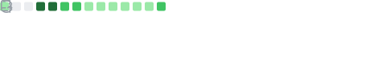

### Hi there 👋

- 🔭 I work at [Swan](https://www.swan.io/) as a Staff Site Reliability Engineer.
- ✍️ Sometimes, I hack on some free software projects (Kubernetes ecosystem, Terraform providers, HomeAutomation, ...).
- 💬 Let's Get In Touch! I am always looking for projects and opportunities.
- 📫 You can find me on [Twitter](https://twitter.com/nlamirault 'Nicolas on Twitter'), [GitHub](https://github.com/nlamirault 'nlamirault on GitHub')... All of my profiles and identities including my **public key**  are **verified on [Keybase](https://keybase.io/nlamirault)**.
- ⚡ Fun fact: I'm a [Pilorari](https://en.wikipedia.org/wiki/Basque_pelota) and a freestyle skier

<!-- https://github.com/simple-icons/simple-icons/blob/develop/slugs.md -->

 
 
 
 

<h2>🚀 Tools</h2>

<h3>☁️ Cloud</h3>

<h3>☸️ Kubernetes</h3>

<h3>🔄 GitOps</h3>

<h3>🏗️ Platform Engineering</h3>

<h3>💥 Chaos Engineering</h3>

<h3>📊 Observability</h3>

<h3>🔒 Security</h3>

<h3>🏗️ IaC</h3>

<h3>💻 Languages</h3>

<h3>🤖 AI</h3>

 

 

