### Hi there 👋

- 🔭 I work at [Swan](https://www.swan.io/) as a Senior Devops.
- ✍️ Sometimes, I hack on some free software projects (Kubernetes echosystem, Terraform providers, HomeAutomation, ...).
- 💬 Let's Get In Touch! I am always looking for projects and opportunities.
- 📫 You can find me on [Twitter](https://twitter.com/nlamirault 'Nicolas on Twitter'), [GitHub](https://github.com/nlamirault 'nlamirault on GitHub')... All of my profiles and identities including my **public key**  are **verified on [Keybase](https://keybase.io/nlamirault)**.
- ⚡ Fun fact: I'm a [Pilorari](https://en.wikipedia.org/wiki/Basque_pelota) and a free skieur

<!-- https://github.com/simple-icons/simple-icons/blob/develop/slugs.md -->

 
 
 
 

<h2>🚀 Tools</h2>

    
    
      
      
      
      
    
    

    
    
    
    
    

    
    
    
    
    
    
    
    
    

    
    
    
    
    
    

    
    
    
        
    
       

    <a href="https://www.golang.org/" target="_blank">     
    <a href="https://www.python.org/" target="_blank"> 
    <a href="https://www.rust-lang.org/" target="_blank"> 

 

 

